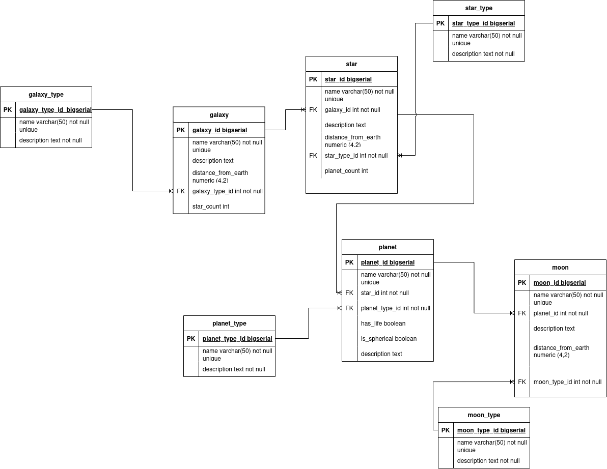

# Celestial Bodies Database - Complement to the Relational Database Course by freeCodeCamp

## Description
This complement is part of the **Relational Database** course offered by freeCodeCamp. In this project, fundamental concepts of relational databases are implemented, including the creation of tables, relationships between entities, and SQL queries.

## Project Objectives
- Understand the principles of relational database design.
- Apply PostgreSQL to manage and manipulate data.
- Visualize entity-relationship models and their practical application in database development.

## Entity Relationship Model

## Celestial Bodies Database
[Celestial Bodies Database](https://www.freecodecamp.org/learn/relational-database/build-a-celestial-bodies-database-project/build-a-celestial-bodies-database)

